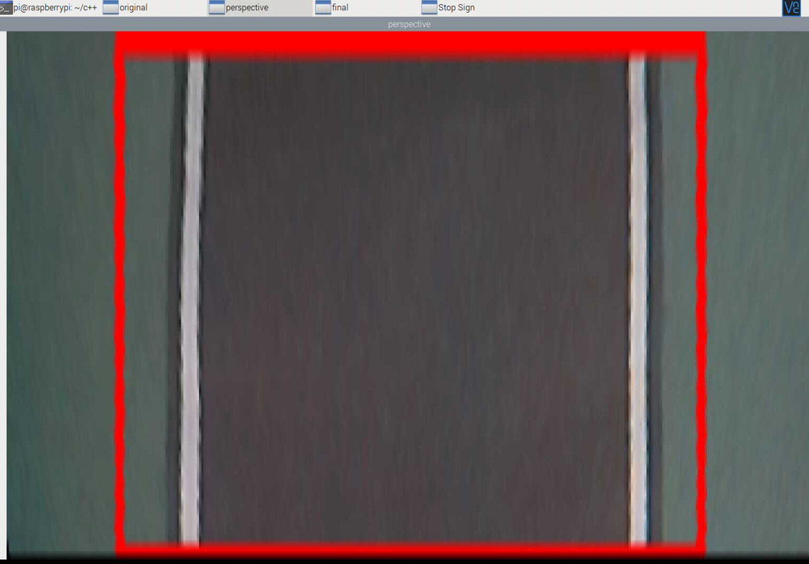

# autonomous_car
Self-driving bot that navigates autonomously in a track through computer vision with OpenCV

__Keywords__: Self-Driven car, RaspberryPi 4, Arduino, C++, Computer Vision, OpenCV, Image Processing, Embedded Computing
## Hardware

  
   

## Lane Detection
Lane detection algorithm involves the following steps
* create a region of interest

* perspective warping of region of interest

* extracting an edge-image by Canny filter
* apply Hough Transform to extract lane lines from the canny edge-image

## Steering
Camera is centered in the chassis of the car and thus the mid point of an image (blue line) is the x-axis of the car. The lane center (green) is computed from the lane edges. The deviation between the lane centre and car's x-axis is computed and is used an input to steer the car. As there is no direct steering mechanism, the vehicle is steered by differential speed of left and right side wheels. RaspberryPi GPIO pins can write only high or low output levels and hence is not suitable to control the motors directly. Arduino-Uno is used a slave device to control (8-bits) the voltage to the motors to adjust the rotational speed. A H-bridge is used to control the left and right motors separately to achieve steering.The deviation of the car's x-axis from the lane center is computed in terms of pixel and based on this value the car is steered left or right or forward.

## Stop-Sign Detection
To detect "Stop" signs a cascade classfier (ensemble of weak classifiers) using HAAR features is trained on positive and negative examples. Positive examples consists of cropped images of  "Stop Signs" taken from varied camera perspective. Negative examples consists of images wich contains everythoing other than the "Stop-Signs"

Positive  Sample               |  Negative Sample
:-------------------------:|:-------------------------:
  |  
  |  

During inference the trained xml file is loaded and "cv::CascadeClassifier" class methods from OpenCV library are used for detecting the stop sign. This send a stop signal to the motors and the car stops.

  
   

